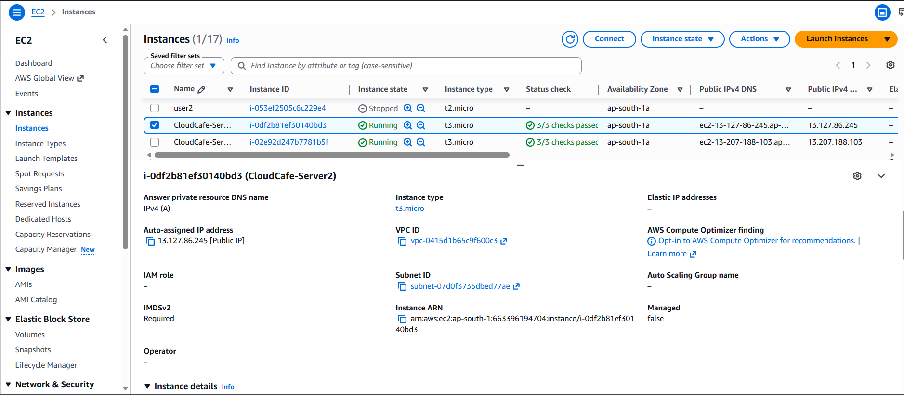
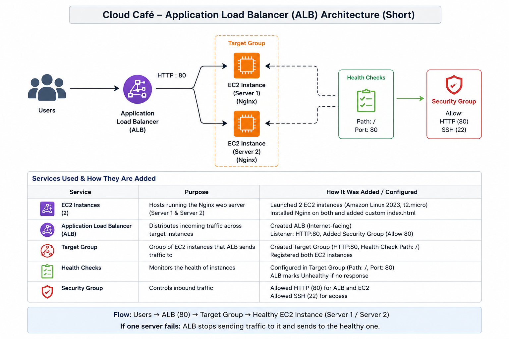
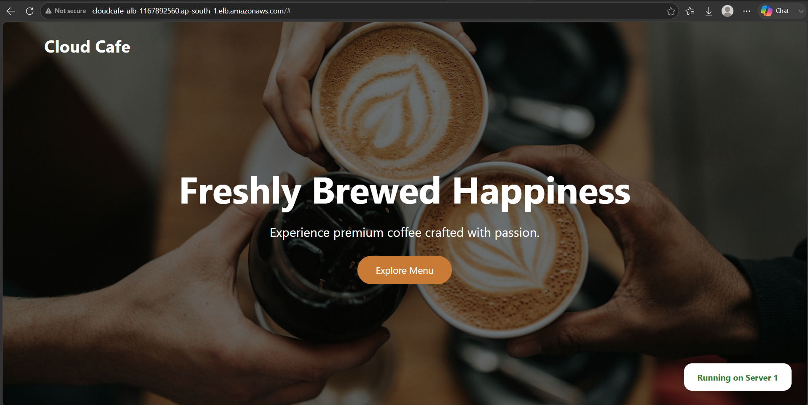

# ☕ Cloud Café – AWS Application Load Balancer Project

## 🚀 Project Overview
Cloud Café is a simple web application deployed on AWS to understand how an **Application Load Balancer (ALB)** distributes incoming user traffic across multiple EC2 instances.

The project demonstrates a highly available web architecture using AWS services.

---

## 🏗️ Architecture

User  
↓  
Application Load Balancer (ALB)  
↓  
Target Group  
↓  
EC2 Instance 1 + EC2 Instance 2  
↓  
Web Application

---

## 🛠️ AWS Services Used

- **Amazon EC2** – Hosted the Cloud Café web application
- **Application Load Balancer (ALB)** – Distributed traffic between EC2 instances
- **Target Group** – Managed registered EC2 instances
- **Security Group** – Controlled inbound and outbound traffic
- **AWS VPC** – Provided networking environment

### 🖥️ EC2 Instances

---

## ⚙️ Project Workflow

1. Created two EC2 instances.
2. Installed and hosted the Cloud Café website on both instances.
3. Configured Security Groups for HTTP access.
4. Created a Target Group and registered EC2 instances.
5. Created an Application Load Balancer.
6. Connected ALB with the Target Group.
7. Tested website accessibility using ALB DNS URL.

---

## 🎯 Why Application Load Balancer?

- Provides high availability
- Distributes user requests across multiple servers
- Prevents single server failure
- Performs health checks on instances

### Application Load Balancer

---

## 🔍 Health Check

ALB continuously checks the health of registered EC2 instances.

- Healthy Instance → Receives traffic
- Unhealthy Instance → Removed from traffic distribution

### Target Group

---

## 📸 Project Screenshots

### Architecture Diagram

### Website Output

)

---

## 🌐 Output

The Cloud Café website is successfully accessible through the Application Load Balancer DNS URL.

---

## 👩‍💻 Author

**Utkarsha Bhokare**

GitHub:  
https://github.com/UtkarshaBhokare47